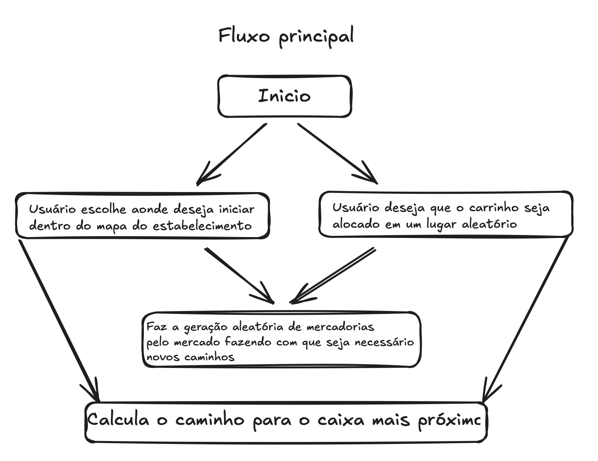

# SmartQueue Market - Gestor de Filas Inteligentes

<div align="center">
  
</div>

## 📋 Índice
- [Visão Geral](#visão-geral)
- [Funcionalidades](#funcionalidades)
- [Tecnologias Utilizadas](#tecnologias-utilizadas)
- [Estrutura do Projeto](#estrutura-do-projeto)
- [Requisitos](#requisitos)
- [Instalação e Execução](#instalação-e-execução)
- [Como Usar](#como-usar)
- [Algoritmos Implementados](#algoritmos-implementados)
- [Cronograma de Desenvolvimento](#cronograma-de-desenvolvimento)
- [Equipe](#equipe)
- [Contribuição](#contribuição)

## 📝 Visão Geral

O **SmartQueue Market** é um simulador avançado para otimização de filas em supermercados, utilizando estrutura de grafos e algoritmos de busca para proporcionar uma experiência mais eficiente aos clientes. Este sistema modela o ambiente de um supermercado como um grafo, onde cada nó representa uma posição no espaço e as arestas indicam os possíveis deslocamentos.

O sistema permite:
- Localizar o caminho mais eficiente até o caixa com menos fila
- Simular obstáculos e áreas congestionadas
- Visualizar graficamente o deslocamento ideal dentro do mercado
- Comparar a eficiência entre diferentes algoritmos de busca

## ✨ Funcionalidades

- **Modelagem Completa**: Representação do mercado como um grafo em estrutura 10x10
- **Algoritmos de Busca**:
  - 🔍 **Busca em Largura (BFS)** - Encontra o caminho mais curto até o caixa disponível
  - 🔎 **Busca em Profundidade (DFS)** - Explora rotas alternativas em caso de obstáculos
- **Interface Gráfica Interativa**:
  - Visualização do mercado em forma de grade
  - Representação visual dos caminhos calculados
  - Simulação de bloqueios aleatórios (filas cheias ou áreas interditadas)
- **Análise de Desempenho**:
  - Comparação de eficiência entre algoritmos
  - Medição de tempo de execução
  - Contagem de passos necessários para chegar ao destino

## 🛠️ Tecnologias Utilizadas

- **Python 3.6+**: Linguagem principal do projeto
- **Tkinter**: Framework para desenvolvimento da interface gráfica
- **Estruturas de Dados Avançadas**: Implementação de grafos, filas e pilhas
- **Algoritmos de Busca**: BFS e DFS otimizados para o contexto de filas

## 📂 Estrutura do Projeto

```
gestor-de-fila-inteligente/
├── src/
│   ├── algorithms/
│   │   ├── bfs.py                # Implementação do algoritmo BFS
│   │   └── dfs.py                # Implementação do algoritmo DFS
│   ├── data/
│   │   └── market_graph.py       # Classe base para o grafo do mercado
│   ├── utils/
│   │   └── visualization.py      # Interface gráfica e lógica de simulação
│   └── main.py                   # Ponto de entrada do programa
├── tests/
│   ├── test_bfs.py               # Testes unitários para BFS
│   └── test_dfs.py               # Testes unitários para DFS
├── requirements.txt              # Dependências do projeto
└── README.md                     # Documentação
```

## 📋 Requisitos

- **Python**: 3.6 ou superior
- **Bibliotecas**:
  - `tkinter` (inclusa no Python padrão)
  - `collections` (para implementação de filas no BFS)
  - `random` (para geração de bloqueios aleatórios)
  - `time` (para medição de desempenho)
  - `unittest` (para execução de testes unitários)
- **Ferramentas recomendadas**: VSCode, Git

## 🚀 Instalação e Execução

### 1. Clone o repositório:

```bash
git clone https://github.com/vitorjimenez/gestor-de-fila-inteligente.git
cd gestor-de-fila-inteligente
```

### 2. Verifique a versão do Python:

```bash
python --version
```

### 3. Execute o programa:

```bash
python src/main.py
# ou
python -m src.main
```

> 💡 Uma janela gráfica será aberta com o simulador de filas.

### 4. Execute os testes unitários:

```bash
python -m unittest tests/test_bfs.py
python -m unittest tests/test_dfs.py
```

## 🖥️ Como Usar

- **Fluxo principal do projeto**: Pequeno fluxograma indicando o fluxo principal do projeto


1. Ao iniciar o programa, uma interface gráfica é exibida com a representação do mercado em uma grade 10x10.
2. O carrinho de supermercado sempre inicia na posição (0, 0), indicado em verde claro (🛒).
3. Os caixas estão localizados nas posições (9, 0), (9, 2), (9, 4), (9, 6) e (9, 9), indicados em azul (💳).
4. Bloqueios aleatórios (10 produtos 📦 em laranja) e 2 empilhadeiras (🚜 em cinza) são gerados fora dos corredores marrons, representando filas cheias ou áreas interditadas.
5. Os corredores marrons estão nas colunas 2, 5 e 8, nas linhas 2 a 5, e não podem ser cruzados pelos caminhos calculados.
6. Clique em "Adicionar Produtos" para gerar os bloqueios e empilhadeiras aleatoriamente.
7. Clique em "Mover Carrinho (Aleatório)" ou clique em uma célula livre para reposicionar o carrinho.
8. Selecione o algoritmo de busca desejado:
    ° "Navegar com BFS" para executar a busca em largura. Se um caminho for encontrado, a busca em profundidade (DFS) será executada automaticamente após a animação do BFS.
    ° "Navegar com DFS" para executar a busca em profundidade manualmente.
9. O caminho calculado será mostrado em amarelo (🟡), garantindo que não passe pelos corredores marrons, e a animação será exibida passo a passo até o caixa.
10. Clique em "Resetar Mercado" para limpar os bloqueios, empilhadeiras e reiniciar o carrinho na posição (0, 0).

## 🧮 Algoritmos Implementados

### Busca em Largura (BFS)
- Encontra o caminho mais curto até um dos caixas disponíveis
- Explora os nós vizinhos antes de avançar para nós mais distantes
- Ideal para encontrar o caminho com menor número de passos
- Implementação usando estrutura de fila para controle de nós a visitar

### Busca em Profundidade (DFS)
- Explora um caminho até sua profundidade máxima antes de retroceder
- Útil para encontrar rotas alternativas quando caminhos diretos estão bloqueados
- Implementação usando pilha ou recursão para controle de exploração
- Pode não encontrar o caminho mais curto, mas é eficiente para explorar o espaço

## 📆 Cronograma de Desenvolvimento

| Etapa | Atividades | Prazo | Status |
|-------|-----------|-------|--------|
| 1 | Definição do objetivo | 24/04/2025 | ✅ Concluído |
| 2 | Seleção dos algoritmos (BFS/DFS) | 30/04/2025 | ✅ Concluído |
| 3 | Escolha das tecnologias | 05/05/2025 | ✅ Concluído |
| 4 | Criação da estrutura de pastas | 10/05/2025 | ✅ Concluído |
| 5 | Implementação do grafo (market_graph) | 10/05/2025 | ✅ Concluído |
| 6 | Implementação de BFS e DFS | 12/05/2025 | ✅ Concluído |
| 7 | Implementação da interface gráfica | 13/05/2025 | ✅ Concluído |
| 8 | Testes e validação | 13/06/2025 | ✅ Concluído |
| 9 | Documentação e apresentação | 15/06/2025 | ✅ Concluído |

## 👥 Equipe

**Nicolas Santana** - Gerente de Projeto
- Definição do escopo, planejamento e acompanhamento

**Vinicius Cerqueira** - Desenvolvedor Backend
- Modelagem do grafo, implementação dos algoritmos BFS e DFS

**Vitor Jimenez** - Desenvolvedor Frontend
- Interface gráfica com Tkinter, interação com o usuário

## 🤝 Contribuição

Contribuições são bem-vindas! Para contribuir:

1. Faça um fork do projeto
2. Crie uma branch para sua feature (`git checkout -b feature/nova-funcionalidade`)
3. Commit suas alterações (`git commit -m 'Adiciona nova funcionalidade'`)
4. Push para a branch (`git push origin feature/nova-funcionalidade`)
5. Abra um Pull Request


